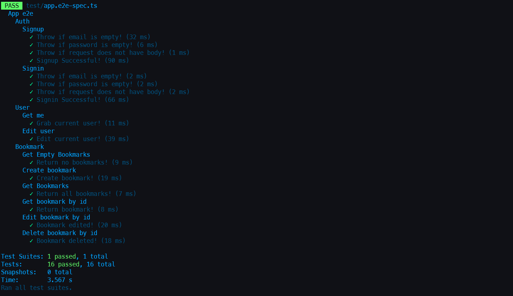

<div align="center"><h1>Bookmarks REST API using Nest.js </h1></div>



# Table of Contents 📖
<!-- no toc -->
- [Introduction ✨](#introduction-)
- [Get started 🚀](#get-started-)
- [License 🔑](#license-)

## Introduction ✨
This is a REST api that allows authenticated users to save their favorite bookmarks in the app's database. Users can register and sign in then proceed to add their favorite online links. Authentication and authorization are handled using signed JWT. The project uses the [Nest.js](https://nestjs.com/) framework and [PostgreSQL](https://www.postgresql.org/) database along with [Prisma](https://www.prisma.io/) as an ORM for the backend. Automated e2e tests are made using [Jest](https://jestjs.io/) and [Pactum](https://pactumjs.github.io/).


## Get started 🚀
* Before you get started, make sure that you have **yarn** package manager enabled. If not, then kindly follow the official docs [here](https://yarnpkg.com/getting-started/install).
* Also make sure that you have [Docker](https://www.docker.com/) installed so that you can get a local database.
1. First clone the repo
```bash
gh repo clone maxlar01/bookmarks-api-nestjs
```
2. Navigate to the root directory and install project dependencies
```bash
yarn install
```
3. Start the database container
```bash
yarn db:dev:up
```
4. Create ".env" and ".env.test" files and add the environment variables: *DATABASE_URL* and *JWT_SECRET*. For the *DATABASE_URL*, grab the user and password from the **docker-compose.yml** file. The *JWT_SECRET* can be any random string. For the ".env.test", make sure to use the test database port which is specified in the **docker-compose.yml** file.
   
5. Run the app
```bash
yarn start:dev
```

6. To run e2e automated tests
```bash
yarn test:e2e
```

## License 🔑
You can read more about it [here](https://choosealicense.com/licenses/mit/).